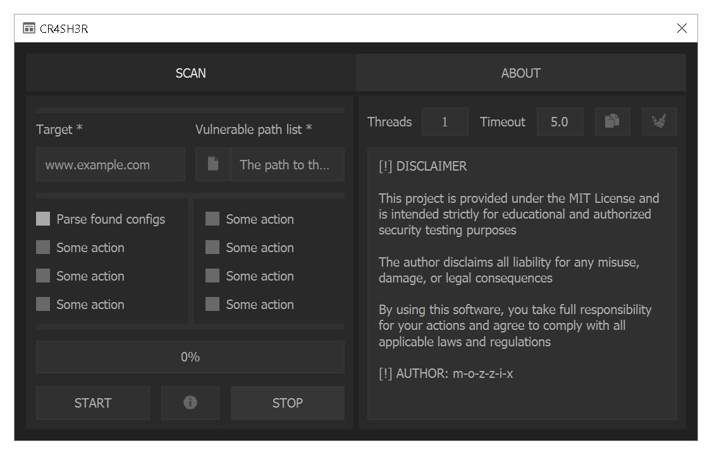
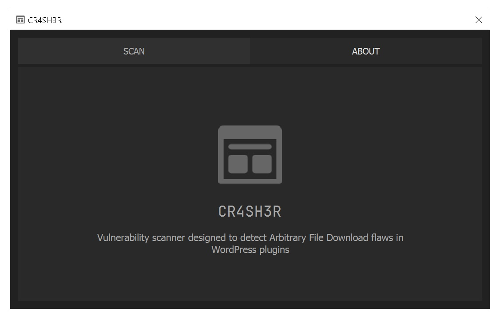

# CR4SH3R

[](./LICENSE)
[](https://github.com/m-o-z-z-i-x/CR4SH3R/releases)


Vulnerability scanner designed to detect [Arbitrary File Download](https://owasp.org/www-community/attacks/Path_Traversal) flaws in WordPress plugins.
It scans a website using a predefined set of paths to extract sensitive data such as database credentials from `wp-config.php`

> [!CAUTION]
>
> **Disclaimer:** This project is provided under the **MIT License**
> and is intended **strictly for educational and authorized security testing purposes**.
> The author **disclaims all liability** for any misuse, damage, or legal consequences.
> By using this software, you take full responsibility for your actions and agree to comply with all applicable laws and regulations

<p align="center">
  
  
</p>

---

## 🚀 Key Features

- **🔀 Multi-threaded scanning** - Fast vulnerability detection using concurrent requests for maximum efficiency
- **🔍 Smart data extraction** - Automatically parses and extracts sensitive data
- **📊 Excel (XLSX) reports** - Clean, organized export of all findings for further analysis
- **🧩 Extendable payloads** - Custom vulnerability paths can be added to expand detection capabilities
- **🖥️ User-friendly GUI** - Intuitive graphical interface for easy operation

---

## 🛠️ Using

Using this tool is very simple:
- **Target** - Enter the domain to scan (e.g., `example.com`)
- **Vulnerable Path List** - Select a text file containing vulnerable paths (one per line)
- **Threads** - Set concurrent threads (1-10, default: 1)
- **Timeout** - Adjust request timeout (1.0 to 9.9, default: 5.0)

> [!TIP]
>
> You can expand detection by adding your own vulnerable paths to the «Vulnerable Path List» file!

---

## 🔨 Develop

### 🔧 Requirements

- Python 3.12+
- Essential packages:
  ```bash
  Nuitka PyQt5 openpyxl niquests python-dotenv
  ```

### ⚡️ Quick Setup Guide

- **Clone & Open Project**
  ```bash
  git clone https://github.com/m-o-z-z-i-x/CR4SH3R.git
  cd CR4SH3R
  code .
  ```
- **Set Up Virtual Environment**
  - In VS Code:
    - Open terminal (`Ctrl+~`/`Ctrl+Shift+~`)
    - Run:
      ```bash
      python -m venv .venv
      ```
  - **Restart VS Code terminal** to auto-activate `.venv`
- **Install Dependencies**
  ```bash
  pip install -r requirements.txt
  ```
- **Run**
	```bash
	python main.py
	```

### 🎨 GUI
  - Open `gui.ui` file in `Designer`:
    ```bash
    .venv/Lib/site-packages/QtDesigner/designer.exe
    ```

> [!TIP]
>
> Create shortcut to `designer.exe` and place it in `ui/` folder for quick access

---

## 🌟 Future Roadmap

**Planned improvements**:
- [ ] **🔄 Auto-updater**
  Built-in version checker for the tool itself
- [ ] **💾 Config presets**
  Save/load frequently used scan configurations
- [ ] **🕒 Session history**
  Track previous scans with timestamps and results
- [ ] **🔒 Encrypted .env file**
  Prevent plaintext exposure when bundled into the binary

*Suggestions?* [Open an Issue](https://github.com/m-o-z-z-i-x/CR4SH3R/issues/new) to discuss new features!

---

## 🤝 Contribution

Contributions are welcome! Here's how to help improve the project:

- **Fork the repository**
- **Create a feature branch**:
  ```bash
  git checkout -b feature/your-feature-name
  ```
- **Commit your changes**:
  ```bash
  git commit -m "Add: your feature description"
  ```
- **Push to your fork**:
  ```bash
  git push origin feature/your-feature-name
  ```
- **Open a Pull Request** to the master branch of this repository

---

## 📈 Repo Activity


---

## 🙏 Support

> ⭐ **Love this project? Give it a star!**

If you find this tool helpful and want to support its development — consider buying me a coffee!

<p align="left">
  <a href="https://yoomoney.ru/to/4100118628464111" target="_blank">
    
  </a>
  <a href="https://boosty.to/m-o-z-z-i-x/donate" target="_blank">
    
  </a>
  <br><br>
  <b>TON Address:</b>
  <blockquote>UQBZVRZFeZI4CepVq_OF5_KiQ_oo62SzmWlGvppfGuyRqUSE</blockquote>
</p>

---

## 📬 Contacts

All my contact links are available [here](https://github.com/m-o-z-z-i-x/m-o-z-z-i-x?tab=readme-ov-file#-contacts)

---

## 📝 License

This project is licensed under the [MIT License](./LICENSE)